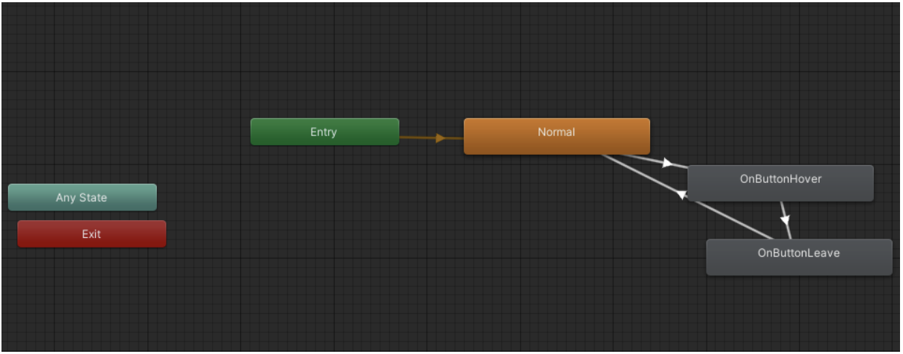

# Game Basic Information #

## Summary ##

**A paragraph-length pitch for your game.**

## Gameplay Explanation ##

**In this section, explain how the game should be played. Treat this as a manual within a game. It is encouraged to explain the button mappings and the most optimal gameplay strategy.**

**If you did work that should be factored in to your grade that does not fit easily into the proscribed roles, add it here! Please include links to resources and descriptions of game-related material that does not fit into roles here.**

# Main Roles #

Your goal is to relate the work of your role and sub-role in terms of the content of the course. Please look at the role sections below for specific instructions for each role.

Below is a template for you to highlight items of your work. These provide the evidence needed for your work to be evaluated. Try to have at least 4 such descriptions. They will be assessed on the quality of the underlying system and how they are linked to course content. 

*Short Description* - Long description of your work item that includes how it is relevant to topics discussed in class. [link to evidence in your repository](https://github.com/dr-jam/ECS189L/edit/project-description/ProjectDocumentTemplate.md)

Here is an example:  
*Procedural Terrain* - The background of the game consists of procedurally-generated terrain that is produced with Perlin noise. This terrain can be modified by the game at run-time via a call to its script methods. The intent is to allow the player to modify the terrain. This system is based on the component design pattern and the procedural content generation portions of the course. [The PCG terrain generation script](https://github.com/dr-jam/CameraControlExercise/blob/513b927e87fc686fe627bf7d4ff6ff841cf34e9f/Obscura/Assets/Scripts/TerrainGenerator.cs#L6).

You should replay any **bold text** with your relevant information. Liberally use the template when necessary and appropriate.

## User Interface (Alex Long)

### Main Menu

The main menu is the first screen that the user sees when they start the game. It contains the game title, start button, credits button, and the quit game button. All the buttons have a hover effect that expands the font size of the button text when you hover over them. The hover effect was created by using two animation clips ([OnButtonHover](https://github.com/Jalastin/ECS-189L-Project/blob/main/ECS%20189L%20Game/Assets/User%20Interface%20Animations/OnButtonHover.anim) and [OnButtonLeave](https://github.com/Jalastin/ECS-189L-Project/blob/main/ECS%20189L%20Game/Assets/User%20Interface%20Animations/OnButtonLeave.anim)) which was responsible for expanding the font size when the button was highlighted and decreasing it back to the normal size when the button is no longer highlighted. After the two animations were created, I added them into the MainMenuButtons animator controller and created the connections between the different states so that the buttons would play the correct animation based on whether they were highlighted or not. This animator controller is used for every buttons’ hover effect. The use case of a hover effect is not only to provide aesthetic pleasure, but also to provide user feedback so that they know it is a clickable UI element. I have attached a screenshot of the animator controller flow chart below for better visualization. 

When any of the main menu buttons are clicked, it calls the corresponding function from the [MainMenu](https://github.com/Jalastin/ECS-189L-Project/blob/main/ECS%20189L%20Game/Assets/Scripts/UI%20Scripts/MainMenu.cs) script which changes the game scene. For example, clicking on the “Start” button will load the level scene and clicking on the “Credits” button will load the credits scene. We also have a “Quit Game” button in case the user wants to exit the application. This scene switching logic is handled by the GameManager so I had to work closely with Alec (GameLogic) to ensure the gameplay logic is integrated successfully. In order for the script to work properly for the buttons, I had to add the MainMenu script and the corresponding button function to the OnClick configuration in Unity. 

In addition, the main menu also has an animated background which infinitely loops over the background image by scrolling to the right at a gradual speed. This was achieved by setting the background image’s wrap mode to “Repeat” and creating the [BackgroundImageScroller](https://github.com/Jalastin/ECS-189L-Project/blob/main/ECS%20189L%20Game/Assets/Scripts/UI%20Scripts/BackgroundImageScroller.cs) script to scroll the image to the right.

## Movement/Physics

**Describe the basics of movement and physics in your game. Is it the standard physics model? What did you change or modify? Did you make your movement scripts that do not use the physics system?**

## Animation and Visuals

**List your assets including their sources and licenses.**

**Describe how your work intersects with game feel, graphic design, and world-building. Include your visual style guide if one exists.**

## Input

**Describe the default input configuration.**

**Add an entry for each platform or input style your project supports.**

## Game Logic

**Document what game states and game data you managed and what design patterns you used to complete your task.**

# Sub-Roles

## Audio

**List your assets including their sources and licenses.**

**Describe the implementation of your audio system.**

**Document the sound style.** 

## Gameplay Testing

**Add a link to the full results of your gameplay tests.**

**Summarize the key findings from your gameplay tests.**

## Narrative Design

**Document how the narrative is present in the game via assets, gameplay systems, and gameplay.** 

## Press Kit and Trailer

**Include links to your presskit materials and trailer.**

**Describe how you showcased your work. How did you choose what to show in the trailer? Why did you choose your screenshots?**

## Game Feel

**Document what you added to and how you tweaked your game to improve its game feel.**
