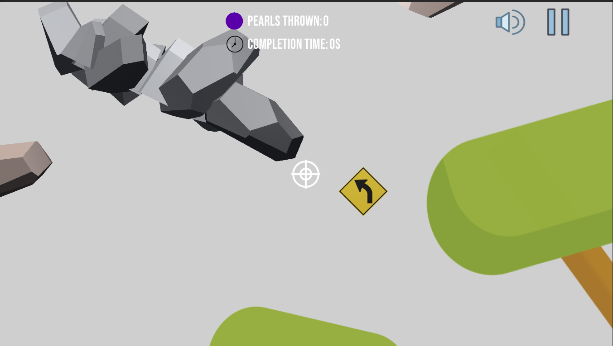

# Game Basic Information #

## Summary ##

Teleporting Over It is a rage platforming game similar to games such as [Getting Over It with Bennet Foddy](https://store.steampowered.com/app/240720/Getting_Over_It_with_Bennett_Foddy/), [Jump King](https://store.steampowered.com/app/1061090/Jump_King/), and [Pogostuck](https://store.steampowered.com/app/688130/Pogostuck_Rage_With_Your_Friends/). However, our unique mechanic is that the player moves by using teleportation pearls, inspired by [Minecraft's Ender Pearls](https://minecraft.fandom.com/wiki/Ender_Pearl). Players will have to traverse several different zones until they can reach the crown waiting for them at the top! Race against your friends, and see who can make it to the crown with the least amount of pearls thrown and in the shortest time.

## Gameplay Explanation ##

The objective of the game is to get through all the obstacles and platforms to reach the top of the level, and hit the crown with a pearl. To move your player, throw a pearl in the direction you want to go and you will teleport wherever the pearl lands.

When using a mouse, press and hold the left click button and then drag in the direction opposite of where you want the pearl to go. Releasing the left click button will cause the pearl to be thrown. Dragging the mouse in the opposite direction simulates a slingshot launch for throwing the pearl, which is demonstrated in the gif below.

When using touchscreen, the inputs are similar to that of the mouse except instead of clicking, it uses a touch and drag input. Then, after touching and dragging, release the finger (or whatever you are using to touch the screen) from the screen to throw. 

When using a gamepad controller, the left joystick is used to aim and clicking the east button will launch the pearl. The joystick inputs are reversed to simulate the slingshot (move left on the joystick to aim right). 

[Here is a link to our project's Google Drive folder. This contains prototypes, builds of the game, and other miscellaneous files.](https://drive.google.com/drive/folders/1rM_QW05-l4RFF0tphhjMGotStppP4UKm?usp=sharing)

[Here is the Project Pitch document.](https://docs.google.com/document/d/1H2ySF7vzezc6XifKAaHX74k3fVtIudEc9DBGZGaahqU/edit)

# Main Roles #

- User Interface + Camera: [Alex Long](https://github.com/ale-long)
- Physics + Movement: [Justin Rusit](https://github.com/Jalastin)
- Animation + Visuals: [Eric Ni](https://github.com/ecni19)
- Input: [Cameron Yee](https://github.com/Cameron327)
- Game Logic: [Alec Atienza](https://github.com/alecF2)
- Level Design: [Devin Ly](https://github.com/devin177)

## User Interface (Alex Long)

### Main Menu

The main menu is the first screen that the user sees when they start the game. It contains the game title, start button, credits button, and the quit game button. All the buttons have a hover effect that expands the font size of the button text when you hover over them. The hover effect was created by using two animation clips ([OnButtonHover](https://github.com/Jalastin/ECS-189L-Project/blob/main/ECS%20189L%20Game/Assets/User%20Interface%20Animations/OnButtonHover.anim) and [OnButtonLeave](https://github.com/Jalastin/ECS-189L-Project/blob/main/ECS%20189L%20Game/Assets/User%20Interface%20Animations/OnButtonLeave.anim)) which was responsible for expanding the font size when the button was highlighted and decreasing it back to the normal size when the button is no longer highlighted. After the two animations were created, I added them into the MainMenuButtons animator controller and created the connections between the different states so that the buttons would play the correct animation based on whether they were highlighted or not. This animator controller is used for the buttons’ hover effect. The use case of a hover effect is not only to provide aesthetic pleasure, but also to provide user feedback so that they know it is a clickable UI element. I have attached a screenshot of the animator controller flow chart below for better visualization. 

When any of the main menu buttons are clicked, it calls the corresponding function from the [MainMenu](https://github.com/Jalastin/ECS-189L-Project/blob/main/ECS%20189L%20Game/Assets/Scripts/UI%20Scripts/MainMenu.cs) script which changes the game scene. For example, clicking on the “Start” button will load the level scene and clicking on the “Credits” button will load the credits scene. We also have a “Quit Game” button in case the user wants to exit the application. This scene switching logic is handled by the GameManager so I had to work closely with Alec (GameLogic) to ensure the gameplay logic is integrated successfully. In order for the script to work properly for the buttons, I had to add the MainMenu script and the corresponding button function to the OnClick configuration in Unity. 

In addition, the main menu also has an animated background which infinitely loops over the background image by scrolling to the right at a gradual speed. This was achieved by setting the background image’s wrap mode to “Repeat” and creating the [BackgroundImageScroller](https://github.com/Jalastin/ECS-189L-Project/blob/main/ECS%20189L%20Game/Assets/Scripts/UI%20Scripts/BackgroundImageScroller.cs) script to scroll the image to the right.

### Credits Scene

The user can reach this screen by clicking on the “Credits” button on the main menu. There is a “Back” button on the top left corner of the screen which allows the user to go back to the main menu screen when clicked. The scene switching logic is handled using the [CreditScreen script](https://github.com/Jalastin/ECS-189L-Project/blob/main/ECS%20189L%20Game/Assets/Scripts/UI%20Scripts/CreditScreen.cs) which is attached to the button. In addition, there is a rolling credits [animation](https://github.com/Jalastin/ECS-189L-Project/blob/main/ECS%20189L%20Game/Assets/User%20Interface%20Animations/Credits%20Scroll%20Animation.anim) which is responsible for gradually moving the credits from the bottom of the screen to the top and repeating afterwards. This was achieved by using the animation tool and placing the credits game object outside of the screen at the bottom during the start of the recording and placing it at the top of the screen near the end of the recording. After the animation file has been created, we simply attach it to the credits game object and the animation will play automatically once the scene loads up. 

### Pause Menu

The pause menu was created by using an overlay with a z index that is larger than the rest of the other UI elements so that the user can interact with the buttons instead of the in-game inputs. The user can open the pause menu by either clicking on the pause icon located at the top right corner of the game, or by pressing the escape key(desktop) or the start key(console). In this menu, I reused the same buttons from the main menu screen and added an additional resume button, as well as an audio slider so the user can adjust the volume. When the user clicks on the resume button, we simply deactivate the overlay game object so they can interact with the game again. The [PauseMenu script](https://github.com/Jalastin/ECS-189L-Project/blob/main/ECS%20189L%20Game/Assets/Scripts/UI%20Scripts/PauseMenu.cs) is responsible for implementing the game logic for the buttons on this screen and was created in collaboration with Alec Atienza (Game Logic) and Cameron Yee (Input). 

The audio slider was created by using the Slider UI game object and attaching the [VolumeSlider script](https://github.com/Jalastin/ECS-189L-Project/blob/main/ECS%20189L%20Game/Assets/Scripts/AudioScripts/VolumeSlider.cs) to implement the volume adjustment logic. I will be explaining more about the audio implementation in the Audio section down below. 

### End Screen

The end screen appears when the pearl successfully collides with the crown when thrown by the player. It is implemented the same way as the pause menu described above with a few adjustments to the UI elements and game logic. The crown is located at the top of the map so the screenshot shown above is for demonstration purposes. When this screen appears, the player can either restart the game, quit the game, or go back to the main menu by clicking on the corresponding buttons. At the top of the screen, we have a congratulatory message and a set of metrics to inform the user about their completion time and how many pearls it took for them to win the game. I used the metric values that were stored by the Game Manager to update the UI elements which was done using the following [lines](https://github.com/Jalastin/ECS-189L-Project/blob/main/ECS%20189L%20Game/Assets/Scripts/UI%20Scripts/EndScreen.cs#L45-L55) in the EndScreen script. An edge case I had to account for was that the user should not be able to open the pause menu when they have reached this screen, as it logically doesn’t make sense and it clutters up the UI elements. This was done by adding an additional check for the current state of the game using the Game Manager in the [PauseScreen script](https://github.com/Jalastin/ECS-189L-Project/blob/main/ECS%20189L%20Game/Assets/Scripts/UI%20Scripts/PauseMenu.cs#L49) and only allowing the player to open the pause menu if they have not won the game yet. The EndScreen script was also created in collaboration with Alec Atienza (Game Logic) and Cameron Yee (Input). 

### In-game UI

The in-game UI consists of several elements: stats, mute audio button, and a pause button. The stats located at the top displays the number of pearls the player has thrown and a timer that keeps track of how long it takes the player to win the game. The UI is updated by calling the values stored in the Game Manager using the [PearlsThrownStatsUI](https://github.com/Jalastin/ECS-189L-Project/blob/main/ECS%20189L%20Game/Assets/Scripts/UI%20Scripts/PearlsThrownStatsUI.cs) and the [CompletionTimeUI](https://github.com/Jalastin/ECS-189L-Project/blob/main/ECS%20189L%20Game/Assets/Scripts/UI%20Scripts/CompletionTimeUI.cs) scripts. 

The audio button located next to the pause button allows the user to conveniently mute any in-game audio by clicking on it. When the audio is muted, the audio icon changes to a muted audio icon image to reflect the current state of the game. This behavior was implemented in the [ToggleAudio Icon script](https://github.com/Jalastin/ECS-189L-Project/blob/main/ECS%20189L%20Game/Assets/Scripts/UI%20Scripts/ToggleAudioIcon.cs) which takes in two sprite images and the audio button game object. The script has a boolean flag to keep track of whether the player is in the muted or unmuted state which allows us to update the button image to reflect the corresponding state. In addition, the actual implementation of pausing the audio is done using the AudioListener.pause property. 

The pause button located at the top right corner allows the user to pause the game when clicked on. This calls the [TogglePauseMenu function](https://github.com/Jalastin/ECS-189L-Project/blob/main/ECS%20189L%20Game/Assets/Scripts/UI%20Scripts/PauseMenu.cs#L77-L81) in the PauseMenu script which updates the game state using the game manager so that the proper UI is displayed.

### Camera Controller

The [camera controller](https://github.com/Jalastin/ECS-189L-Project/blob/main/ECS%20189L%20Game/Assets/Scripts/CameraController.cs) implemented in our game is similar to the PositionFollowCameraController implemented in exercise 2 with a few minor adjustments. Our camera is centered on the player by default when a pearl is not thrown or if they have teleported to a new location. When the player throws a pearl that goes out of the screen, the camera is then centered on the pearl until the player has teleported to the designated location. It is important to note that the camera moves at a speed of 0.5 when it refocuses on a different target, which allows for a smooth camera movement as opposed to immediately centering on the target. To check whether the pearl is thrown off the screen, we had to convert the pearl’s position using the WorldToViewportPoint function and if its x and y values are not between 0-1, and the z value is not greater than 0, then it is out of the screen. Once this happens, we update the boolean flag and refocus our camera on the pearl by using the Vector3.MoveTowards function. If the player has teleported to the location, we reset the boolean flag to false and refocus the camera back onto the player. This script was created in collaboration with Devin Ly (Level Design) and Justin Rusit (Movement/Physics). 

### UI Resources

- [Creating a Title Screen Menu](https://www.youtube.com/watch?v=BjEqZfK15Ws)

- [Rolling Credits Scene](https://www.youtube.com/watch?v=cj6hwCjiVZE)

- [Background Animation Scroller](https://www.youtube.com/watch?v=A5YSbgqr3sc)

- [Button Hover Effect](https://www.youtube.com/watch?v=jh3zD-wGBnw)

- [Changing Button Image](https://www.youtube.com/watch?v=__M37MbOa8Q)

- [Checking if GameObject is out of the Screen](https://answers.unity.com/questions/8003/how-can-i-know-if-a-gameobject-is-seen-by-a-partic.html)

- [Creating an Audio Slider](https://johnleonardfrench.com/the-right-way-to-make-a-volume-slider-in-unity-using-logarithmic-conversion/)

- [Bebas Neue Font](https://fonts.google.com/specimen/Bebas+Neue)

Icons:

- [Pause Icon](https://icons8.com/icon/GECJlGuEdNiC/audio)

- [Unmuted Audio Icon](https://icons8.com/icon/mOCY88ZDOzkO/audio)

- [Muted Audio Icon](https://icons8.com/icon/VYymocF7cTKJ/audio)

- [Clock Icon](https://icons8.com/icon/8YCHhvwCdMI0/clock)

## Movement/Physics (Justin)

### Player and Pearls

- The player cannot move themselves. Instead, all traversal is done by throwing a teleportation pearl. Once a pearl is thrown and contacts a platform, [there is a short delay before the player is teleported to the pearl’s current position.](https://github.com/Jalastin/ECS-189L-Project/blob/27cb90eab9e09bc26799145d52d03a31f66e6ad1/ECS%20189L%20Game/Assets/Scripts/Pearl%20Scripts/PearlController.cs#L10)

- Projectile instantiation is done [using the Factory design pattern](https://github.com/Jalastin/ECS-189L-Project/tree/main/ECS%20189L%20Game/Assets/Scripts/Pearl%20Scripts) as seen in exercise 4. The strength of the pearl’s force and the pearl’s direction are dependent on player input (which will be explained further in the input section) and [is passed in as the spec](https://github.com/Jalastin/ECS-189L-Project/blob/27cb90eab9e09bc26799145d52d03a31f66e6ad1/ECS%20189L%20Game/Assets/Scripts/PlayerController.cs#L375) for the newly instantiated pearl. [I use AddForce](https://github.com/Jalastin/ECS-189L-Project/blob/27cb90eab9e09bc26799145d52d03a31f66e6ad1/ECS%20189L%20Game/Assets/Scripts/Pearl%20Scripts/PearlMotion.cs#L23) to add the specified force to the pearl on instantiation.

- The force a pearl can be is also restricted by [the Player’s maxForce.](https://github.com/Jalastin/ECS-189L-Project/blob/46f1f5efad5605ec99dda076db785dbdd49e43b7/ECS%20189L%20Game/Assets/Scripts/PlayerController.cs#L340) This is visualized by the [Pearl Arc Line](https://github.com/Jalastin/ECS-189L-Project/blob/5c3e441ac8dfb8ed8a66e1fde5f78096d9b36cd0/ECS%20189L%20Game/Assets/Scripts/PlayerController.cs#L455), which visualizes the current strength and direction of the user's current throw.

- The Player and Pearl utilize Unity’s Rigidbody2D’s so that both are affected by gravity during the game. I also locked the Player’s Z rotation so that way they would always stay upright and not “tip” over.

- The Player and Pearl utilize Unity’s 2D Colliders to detect collisions. The Player needs a Collider2D so that it can sit on different platforms properly. [But when the pearl collides with another Collider2D, it enables a HasCollided bool.](https://github.com/Jalastin/ECS-189L-Project/blob/27cb90eab9e09bc26799145d52d03a31f66e6ad1/ECS%20189L%20Game/Assets/Scripts/Pearl%20Scripts/PearlController.cs#L33) This allows the teleportation delay to start counting down for eventual player teleportation.

### Physics Materials

- Using Physics 2D Materials, I created three different materials - an [ice](https://github.com/Jalastin/ECS-189L-Project/blob/main/ECS%20189L%20Game/Assets/Resources/Ice%20Material.physicsMaterial2D), [slime](https://github.com/Jalastin/ECS-189L-Project/blob/main/ECS%20189L%20Game/Assets/Resources/Slime%20Material.physicsMaterial2D), and [default](https://github.com/Jalastin/ECS-189L-Project/blob/main/ECS%20189L%20Game/Assets/Resources/Default%20Material.physicsMaterial2D) material. Ice has decreased friction, slime has increased bounciness, and normal has standard friction and no bounciness. These three materials were utilized in level design to increase the difficulty of certain sections of the level.

### Dark Zone

- I created a “Dark Zone” using Sprite Masks following [this tutorial.](https://youtu.be/EfXLi6AWc_4) In my case, both the player and pearl have a “flashlight” child object which lets them see through darkness within a close vicinity of the respective parent GameObjects. [I also added some extra code so that when the Player enters the Dark Zone, it slowly becomes darker until it hits the specified darknessStrength.](https://github.com/Jalastin/ECS-189L-Project/blob/main/ECS%20189L%20Game/Assets/Scripts/DarkZoneController.cs)

### Wind Zone

- There is also a [Wind Zone](https://github.com/Jalastin/ECS-189L-Project/tree/main/ECS%20189L%20Game/Assets/Scripts/Wind%20Scripts) that adds a wind force to increase the difficulty of the game. Every GameObject within the Zone (besides Platforms and the Player) has its velocity affected by a specified wind force. I utilized [OnTriggerStay2D](https://github.com/Jalastin/ECS-189L-Project/blob/27cb90eab9e09bc26799145d52d03a31f66e6ad1/ECS%20189L%20Game/Assets/Scripts/Wind%20Scripts/WindZoneController.cs#L22) to apply the wind force to any objects with a Rigidbody2D within the zone.

- The wind force varies based on an [Attack, Decay, Sustain, Release curve.](https://github.com/Jalastin/ECS-189L-Project/blob/main/ECS%20189L%20Game/Assets/Scripts/Wind%20Scripts/ADSRManager.cs) While the base code was based off of [Professor McCoy’s original ADSR Manager,](https://github.com/dr-jam/GameplayProgramming/blob/master/Projects/ADSR/Assets/Scripts/ADSRManager.cs) I heavily modified the Start() and Update() portion of the code. During the ADSR curve, I calculate the wind force based off of an initial force and the position in the curve. After the ADSR ends, I wait timeBeforeRestart time before I restart the ADSR curve (by switching to Attack phase) and flipping the direction of the wind force.

- The Wind Zone also has a Factory attached to it that creates WindSprites. [These WindSprites simply spawn for a specified time, and are used to visualize the current wind force on the screen.](https://github.com/Jalastin/ECS-189L-Project/blob/main/ECS%20189L%20Game/Assets/Scripts/Wind%20Scripts/WindSpriteController.cs) The position they spawn at is randomized to be [somewhere within the Wind Zone.](https://github.com/Jalastin/ECS-189L-Project/blob/46f1f5efad5605ec99dda076db785dbdd49e43b7/ECS%20189L%20Game/Assets/Scripts/Wind%20Scripts/WindSpriteSpec.cs#L18) You can see the WindSprite cloud at the very top of the gif shown below.

### Resources Used

- [Professor McCoy's original Factory Design Pattern implementation](https://github.com/dr-jam/GameplayProgramming/tree/master/Projects/Factory/Assets/Scripts)

- [Professor McCoy’s original ADSR Manager](https://github.com/dr-jam/GameplayProgramming/blob/master/Projects/ADSR/Assets/Scripts/ADSRManager.cs)

- [Sprite Mask tutorial for Dark Zone](https://youtu.be/EfXLi6AWc_4)

## Animation and Visuals (Eric Ni)
### Assets Used
Level design:
- [Getting Started Mods Asset Pack](https://assetstore.unity.com/packages/3d/props/clothing/getting-started-mods-asset-pack-141501) by Unity Technologies licensed under [Standard Unity Asset Store EULA](https://unity3d.com/legal/as_terms)
- [Flat Platformer Template](https://assetstore.unity.com/packages/2d/environments/flat-platformer-template-108101) by Bulat licensed under [Standard Unity Asset Store EULA](https://unity3d.com/legal/as_terms) 
- [3LE Low Poly Cloud Pack](https://assetstore.unity.com/packages/3d/3le-low-poly-cloud-pack-65911) by The Fallout Nerd licensed under [Standard Unity Asset Store EULA](https://unity3d.com/legal/as_terms)
- [Free Hand Painted Rocks 'N' Boulders](https://assetstore.unity.com/packages/3d/free-hand-painted-rocks-n-boulders-80634) by Poly Ninja licensed under [Standard Unity Asset Store EULA](https://unity3d.com/legal/as_terms)
- [Hats pack - 3D Microgames Add-Ons](https://assetstore.unity.com/packages/3d/hats-pack-3d-microgames-add-ons-163011) by Unity Technologies licensed under [Standard Unity Asset Store EULA](https://unity3d.com/legal/as_terms)
- [Low Poly Rock Pack](https://assetstore.unity.com/packages/3d/environments/low-poly-rock-pack-57874) by Broken Vector licensed under [Standard Unity Asset Store EULA](https://unity3d.com/legal/as_terms)
- [Snowy Low-Poly Trees](https://assetstore.unity.com/packages/3d/vegetation/trees/snowy-low-poly-trees-76796) by False Wisp Studios licensed under [Standard Unity Asset Store EULA](https://unity3d.com/legal/as_terms)
- [US Road Signs Free](https://assetstore.unity.com/packages/3d/props/exterior/us-road-signs-free-164941) by Covalence Studios licensed under [Standard Unity Asset Store EULA](https://unity3d.com/legal/as_terms)

Character design:
- [Free 2D Fantasy Characters Easy to Rig](https://assetstore.unity.com/packages/2d/characters/free-2d-fantasy-characters-easy-to-rig-214009) by ThunderCube Games licensed under [Standard Unity Asset Store EULA](https://unity3d.com/legal/as_terms)

### Visual Style
For our game, we wanted a visual style that would involve simple, yet nice-looking graphics. As a result, I found some Unity assets that fit our needs and they were applied to our level design. Furthermore, since our game relies heavily on aiming and landing the ball on platforms, I thought that a less-intrusive visual style would make the game experience better for players. Another visual style decision we decided to make was to use 3D objects in a 2D platformer, similar to Getting Over It with Bennett Foddy, because it adds a sense of depth. As for the playable character, I found a [sprite](https://assetstore.unity.com/packages/2d/characters/free-2d-fantasy-characters-easy-to-rig-214009) on the Unity store that could seamlessly integrate skeletal animations as opposed to making one. This decision was influenced by the time constraint and my lack of experience with pixel art. 

### Animation System
To create the animations for this game, I utilized Unity’s skeletal animations for 2D sprites. Skeletal animation, also known as rigging, is an easy to pick up method of animation for beginners. Unity’s skeletal animation system is very intuitive to use and does not require a lot of setup to get started. The first step that I did to create an animation was adding a set of individual, controllable “bones” to a 2D sprite.

Once this was done, Unity’s animation tab provided an interactive timeline to create keyframes, which are essentially the start and end points of the sprite’s action. After these start and end points are created, Unity will interpolate the movement between the two points to allow the sprite to reach its target position. I created three main animations for our game: idling, throwing, and falling. 

Next, I had to utilize Unity’s animation state machine to create transitions between the different animations. In the picture below, idling is the entry state, and there are two additional ones: Throwing and ActualFalling. Idling is able to reach Throwing if the Throw boolean parameter is true and the same is for ActualFalling and Fall. Throwing or ActualFalling can transition back to idling if Throw or Fall, respectively, are false. An additional transition from ActualFalling to Throwing based on Throw is necessary to account for throwing while falling.

In the code, the transitions are handled like so: 

`player.GetComponent<Animator>().SetBool(String parameterName, bool value);`

The name of the boolean parameter is the first argument and the value you wish to change it to is the second. For example, this line of code is used with `parameterName=“Throw”` and `value=true` whenever fire1 is detected so that the animation state machine can transition to Throwing. [Here is an example from our code that demonstrates this](https://github.com/Jalastin/ECS-189L-Project/blob/ca5de50ae675feefa4e1c7ec9d979ae68c04e6c0/ECS%20189L%20Game/Assets/Scripts/PlayerController.cs#L421-L422).

[This YouTube video](https://www.youtube.com/watch?v=eXIuizGzY2A) provided an excellent foundation for me to learn skeletal animations. 

## Input (Cameron Yee)

## Input Configuration
- The default input configuration to interact with this game changes depending on which device the game is reading input from. 

### Desktop
- When using a mouse, press and hold the left click button and then drag in the direction opposite of where you want the pearl to go. Releasing the left click button will cause the pearl to be thrown. Dragging the mouse in the opposite direction simulates a slingshot launch for throwing the pearl. In addition, on any of the scenes, you can use the left mouse button to interact with any of the UI elements. 

### Mobile
- When using touchscreen, the inputs are similar to that of the mouse except instead of clicking, it uses a touch and drag input. Then, after touching and dragging, take the finger (or whatever you are using to touch the screen) off the screen to actually launch. In addition, on any of the scenes, you can use touch to interact with any of the UI elements. 

### Console
- When using a gamepad controller, the left joystick is used to aim and clicking the east button will launch the pearl. The joystick inputs are reversed to simulate a slingshot (move left on the joystick to aim right). In addition, press the start button on the controller to open the pause menu. When interacting with any of the menu screens, use the left joystick to move the gamepad cursor and press the “B” button to click the UI elements. 

## Input Implementation (How it Works)
- All input that controls the pearl is done in the `PlayerController.cs` script. Specifically for the gamepad, to interact with the UI, the logic is done in the `GamepadCursor.cs` script.

### Desktop
- Launching the pearl: The input works by first getting the position of the cursor whenever the user clicks and holds on the screen ([here](https://github.com/Jalastin/ECS-189L-Project/blob/29c14b7ea9d6afa84fbf7ef76ab77b8625241f32/ECS%20189L%20Game/Assets/Scripts/PlayerController.cs#L349)). While still not letting go of the click, the user can move the cursor in any direction to aim the pearl (if the user moves to the left, it will aim to the right). We use this distance traveled from the current mouse position to where the user first clicked to calculate the force and direction that the player will throw the pearl ([here](https://github.com/Jalastin/ECS-189L-Project/blob/29c14b7ea9d6afa84fbf7ef76ab77b8625241f32/ECS%20189L%20Game/Assets/Scripts/PlayerController.cs#L361)). Then, a pearl trajectory line is drawn based on force magnitude and direction to depict the force and direction of the throw once the player releases the click ([here](https://github.com/Jalastin/ECS-189L-Project/blob/29c14b7ea9d6afa84fbf7ef76ab77b8625241f32/ECS%20189L%20Game/Assets/Scripts/PlayerController.cs#L455)). In addition, we have to account for a maximum force value to balance the game (which was refined upon by Justin Rusit (Movement/Physics and Game Feel)) ([here](https://github.com/Jalastin/ECS-189L-Project/blob/29c14b7ea9d6afa84fbf7ef76ab77b8625241f32/ECS%20189L%20Game/Assets/Scripts/PlayerController.cs#L380)). So, even if the user moves the mouse really far away from the starting click position, the force will be capped at a certain value and the pearl trajectory line will reflect this maxed value. Finally, when the user releases the click, the force will be passed into a factory that creates the pearl according to the direction and force values that we gathered ([here](https://github.com/Jalastin/ECS-189L-Project/blob/29c14b7ea9d6afa84fbf7ef76ab77b8625241f32/ECS%20189L%20Game/Assets/Scripts/PlayerController.cs#L426)). 

- Interacting with the UI: The mouse and UI compatibility is built-in so no extra code was needed to get the mouse to interact with the UI elements.

### Mobile
- Launching the pearl: The mobile version of launching the pearl works almost exactly the same as the desktop version except instead of looking for a mouse click event, it will look for a single touch on the screen. Touch and hold to get the starting point ([here](https://github.com/Jalastin/ECS-189L-Project/blob/29c14b7ea9d6afa84fbf7ef76ab77b8625241f32/ECS%20189L%20Game/Assets/Scripts/PlayerController.cs#L167)), move your finger (or whatever you are using to touch the screen) to affect force and direction ([here](https://github.com/Jalastin/ECS-189L-Project/blob/29c14b7ea9d6afa84fbf7ef76ab77b8625241f32/ECS%20189L%20Game/Assets/Scripts/PlayerController.cs#L182)), then release the touch to launch the pearl ([here](https://github.com/Jalastin/ECS-189L-Project/blob/29c14b7ea9d6afa84fbf7ef76ab77b8625241f32/ECS%20189L%20Game/Assets/Scripts/PlayerController.cs#L245)). 

- Interacting with the UI: The touch and UI compatibility is built-in so no extra code was needed to get the touch to interact with the UI elements.

### Console
- Launching the pearl: For the console version, launching the pearl uses a different method. To get its equivalent starting position, we initialize a variable vector with a value of 0. Then, we get the joystick input through the input system ([here](https://github.com/Jalastin/ECS-189L-Project/blob/29c14b7ea9d6afa84fbf7ef76ab77b8625241f32/ECS%20189L%20Game/Assets/Scripts/PlayerController.cs#L83)) and add that value to the variable vector ([here](https://github.com/Jalastin/ECS-189L-Project/blob/29c14b7ea9d6afa84fbf7ef76ab77b8625241f32/ECS%20189L%20Game/Assets/Scripts/PlayerController.cs#L269)). This value gets updated every frame so that our variable will always be updated based on the input given by the left joystick. Since this variable is a vector, we can get a direction and a magnitude for the pearl launch and the trajectory line. To actually launch the pearl, the user will click the “B” button which will pass those values (magnitude and direction) into the pearl factory function ([here](https://github.com/Jalastin/ECS-189L-Project/blob/29c14b7ea9d6afa84fbf7ef76ab77b8625241f32/ECS%20189L%20Game/Assets/Scripts/PlayerController.cs#L334)). 

- Interacting with the UI: To interact with the UI elements using a console controller, I created a virtual mouse that would work in sync with the input action given by the controller. This is because the gamepad controller doesn’t have a default cursor to interact with the UI like the mouse and touch do. So, to implement this, I created a separate game object with a script (`GamepadCursor.cs`) that would control a cursor UI element which is put on every scene (with the help of Alex Long (User Interface)). This script will move this virtual cursor or it will simulate a click for this virtual cursor depending on the input action from the gamepad controller.

## Input References
- [Gamepad Cursor Tutorial](https://youtu.be/Y3WNwl1ObC8)
- [Connecting a wireless controller](https://youtu.be/adJM4Ps44z0)
- [Mouse, Touch, and Controller Input System Tutorial](https://youtu.be/Yjee_e4fICc)
- [Reading gamepad controller input tutorial](https://youtu.be/p-3S73MaDP8)
- [Unity Manual: Mobile device input](https://docs.unity3d.com/2020.3/Documentation/Manual/MobileInput.html)

## Game Logic

**Document what game states and game data you managed and what design patterns you used to complete your task.**

## Level Design (Devin Ly)

The defining characteristic of *Teleporting Over It*'s level design is how the entire game is contained in one level. While there are thematic boundaries between certain sections of the map, there exists only one scene which contains all of the assets that make up the game. In designing the game as such, we provide a smooth gameplay experience to the players because they do not have to wait for different maps/scenes to load. Additionally, by making the entire map interconnected, we allow players to experience the "rage" factor of being setback to the beginning.

### Using the Assets
*Teleporting Over It* is a 2D game, but contains both 2D and 3D assets in its level design. To make sure the appearance of 3D objects did not change as the camera followed our player, I set the camera type to orthographic, meaning all objects would appear the same in size, despite their distance from the lens.

**Perspective Camera**

**Orthographic Camera**

In order for our player to be able to traverse the map, its pearl needed to be able to collide with objects, so every object the player can interact with is equipped with a collider. For simple objects, like these trees, the pre-made colliders provided by Unity were enough to make a hitbox that accurately reflected the shape of the object.

However, our map also consists of more complex objects. To encompass these, I utilized Unity's Polygon Collider. With this, I was provided an array of points that I could manipulate to suit the shape of any specific object. For complex 2D objects, the Polygon Collider was often able to automate outlining the shape. For 3D objects however, this was never the case. (This is because Polygon Colliders are the general collider for complex 2D objects, whereas 3D objects usually use Mesh Colliders. To suit our 2D game, I needed to modify how I used the Polygon Collider for 3D objects.)

With the interactions between our level and the camera/player intact, all that was left was to design the actual level. Using free assets from the Unity Asset Store, as well as the prefabs for the different types of zones created by Justin, I put together a map. The overall shape of the map mimics that of *Getting Over It*, with the later stages of the game looming over the beginning. This shape allows for the player to drop if they are not careful. As for the aesthetics (and narrative design) of the map, they are broken up into stages.

### Stages
*Teleporting Over It* can be thought of as being split into 4 stages, each with its own distinct theme.

### Stage 1: City
This simple stage constructed of familiar objects and buildings is the players introduction to the game. There is a billboard explaining how to operate our game, and the player is introduced to signs which tell them where to go. The obstacles/platforms to navigate are not too far apart, and the drops are still easy to come back from.

### Stage 2: Mountain and Forest
The second stage of the game brings the player out of the city and into a mountainous forest region. The platforms the player needs to traverse start to become farther apart, and the risk they take with each throw of the pearl becomes greater as they have more to lose.

### Stage 3: Cave
The third stage introduces a new mechanic to the game: the dark zone. With limited visibilty, the player must throw their pearl to see where they are going. This, of course, presents its own dangers because they can over-throw, and end up right where they started. The player can easily become lost in the darkness of this area, but the signs that guide them are always visible. (The specifics of how the dark zone is implemented can be found in the physics/movement section.)

### Stage 4: Wind and Snow
The final stage of *Teleporting Over It* also introduces a new mechanic: wind gusts. The player can make their choice of where and how hard to throw their pearl, but are still subject to the randomness of the wind. The stakes are at their highest as the player now has the most to lose, but if they are able to persevere through this difficult stage, they will be rewarded.

### Level Design Resources

- [Game Design Interview with Bennet Foddy](https://www.youtube.com/watch?v=QbpMYH-8g54)
- [Unity Documentation for Polygon Collider 2D](https://docs.unity3d.com/Manual/class-PolygonCollider2D.html)

Assets used can be found in the previous Animation and Visuals section.

# Sub-Roles

- Audio: [Alex Long](https://github.com/ale-long)
- Gameplay Testing: [Eric Ni](https://github.com/ecni19)
- Narrative Design: [Devin Ly](https://github.com/devin177)
- Press Kit + Trailer: [Alec Atienza](https://github.com/alecF2)
- Game Feel: [Justin Rusit](https://github.com/Jalastin)
- Cross-Platform: [Cameron Yee](https://github.com/Cameron327)

## Audio (Alex Long)

[Audio Citations](https://github.com/Jalastin/ECS-189L-Project/blob/main/ECS%20189L%20Game/Assets/Resources/Audio/README.md)

### Background Music

Each scene has a different background music that plays when the scene is successfully loaded. The general theme for the music collection is upbeat and relaxing to bring out positive energy to the players despite this being a rage game. Every scene has an audio source game object which is responsible for playing the background music upon awake and on loop. For example, I used the [CreditsBackgroundMusic](https://github.com/Jalastin/ECS-189L-Project/blob/main/ECS%20189L%20Game/Assets/Resources/UI/Prefabs/CreditsBackgroundMusic.prefab) audio source object in the credits scene to play the background music. 

### Sound Effects

There are three in-game sound effects that are generated based on different scenarios:
- When the player releases the pearl 
- When the pearl collides with the surface 
- When the player teleports 
 
To manage the different sound effects, I created a [SoundEffectManager](https://github.com/Jalastin/ECS-189L-Project/blob/fmain/ECS%20189L%20Game/Assets/Scripts/AudioScripts/SoundEffectManager.cs) script which was attached to the SoundManager game object. The SoundManager object is used in both the PlayerController and the Pearl Controller script to play the corresponding sound effects by calling the functions within the SoundEffectManager script. For [example](https://github.com/Jalastin/ECS-189L-Project/blob/main/ECS%20189L%20Game/Assets/Scripts/Pearl%20Scripts/PearlController.cs#L36), when the pearl collides with a surface, the sound manager object will call the function to play the corresponding sound. 

### Volume Slider

The volume slider allows players to conveniently adjust the audio to their level of comfort. This was achieved by creating a [SoundMixer](https://github.com/Jalastin/ECS-189L-Project/blob/main/ECS%20189L%20Game/Assets/Resources/Audio/BackgroundMusic/SoundMixer.mixer) using the Audio Mixer Controller tool. This allows us to control the output volume of the different audio sources we have by exposing the audio mixer parameter to the [VolumeSlider script](https://github.com/Jalastin/ECS-189L-Project/blob/main/ECS%20189L%20Game/Assets/Scripts/AudioScripts/VolumeSlider.cs) . The script is responsible for updating both the audio slider UI element, to reflect the latest adjusted volume value, and the Audio Mixer based on user input from the audio slider. Everytime the user adjusts the volume via the audio slider, the [SetVolume](https://github.com/Jalastin/ECS-189L-Project/blob/main/ECS%20189L%20Game/Assets/Scripts/AudioScripts/VolumeSlider.cs#L22-L27) function is called to update the Audio Mixer output and the GameManager with the latest volume value so that it persists across all the scenes.

### Audio Resources

[Audio Mixer](https://johnleonardfrench.com/the-right-way-to-make-a-volume-slider-in-unity-using-logarithmic-conversion/)

[Adding Sound Effects](https://www.youtube.com/watch?v=JnbDxG04i7)

[Adding Background Music](https://www.youtube.com/watch?v=BKCsH8mQ-lM)

[Audio Mute](https://www.youtube.com/watch?v=AFcHsKd_aMo)

## Gameplay Testing (Eric Ni)
### Full Results
[Here](https://docs.google.com/spreadsheets/d/1l5B2j9orXCkTKH-3FpbBYp7sOwFQe5DOvdGOhTJv9Fs/edit?usp=sharing) are the full results of our gameplay testing (done via Google forms because of COVID exposure).

### Key Findings
#### **Game Feel and Experience:**
- In our demo version, many players were confused as to which direction they needed to move in upon spawning. As a result, we have added road signs that should solve this issue.
- The instructions provided at the beginning of the game seemed to give players a good idea about what would happen when they launched a pearl projectile.
- Most players think the game controls feel good and were intuitive as well. The only concern was with the pearl's launch speed, and we have addressed this by adding more force to it when throwing.
- Similar to the previous point, players were mostly frustrated with the sluggish speed of the pearl because it takes a long time for it to collide with a platform. 
- Playtesters commented on the shape of some platforms causing the player to slide. However, this was intential to our level's design, as this created another layer of difficulty for the game.
#### **Game Concept:**
- Most playertesters had a good first impression of the game. They thoroughly enjoyed the art style, gameplay, and the game's concept. Upon playing the demo, playtesters felt that our game did fit the rage-game genre.
- The level transitions were smooth, but some playtesters believe there should be more distinct differences in difficulty between stages.
- When asked about the appeal of the game, playtesters responded by describing the game as a casual, but rage-inducing, game that had satisfying gameplay elements.
#### **Player Feedback:**
- Aside from a more fleshed out options menu that has more settings to change, playtesters did not have any additional game controls or interface features that they wanted to see implemented.
- As mentioned previously, a majority of the playtesters would like to see a faster moving pearl, so that is something we have improved. Some players also wanted to remove the ability for the player to slide on angled surfaces.
- The only interface-related concern we received was that the pause and mute buttons would sometimes be covered by the level. Since conducting user testing, we have resolved this issue.
- An overwhleming number of playtesters wanted different music for the game, and we agreed. We changed the music to be more calming and less intrusive for players.

## Narrative Design (Devin Ly)

The narrative goal of this project was to create a game that truly encompassed the famous first sentence of *A Tale of Two Cities*: "It was the best of times, it was the worst of times..." With inspiration from games like *Getting Over It* and *Jump King*, we decided to create a "rage" game. We believe the unforgiving nature of such games allows users to experience both high highs when they successfully traverse a difficult section, and low lows when they fall off a cliff immediately after. With this in mind, we designed *Teleporting Over It* to emphasize its gameplay experience rather than its aesthetics, meaning the visual style of the game is very simple. The interactive parts of the map are mostly low-poly models of houses, rocks, and trees. There are several portions of the map that contain more complex models such as traffic signs and the crown finish line, but these are only to act as signifiers. Instead of being presented with hyper-realistic models of people, weapons, or landscapes, players are encouraged to focus on navigating the map -- on enjoying the journey. We designed the gameplay system to consist only of throwing a pearl towards your destination for the very same reason: to allow our users to feel the elatedness and frustration that comes along with an adventure.

As mentioned earlier, the level design reflects our narrative as well. The types of obstacles, the color scheme, and the danger the player faces very much reflect the feelings someone has as they embark on a journey.

## Press Kit and Trailer

**Include links to your presskit materials and trailer.**

**Describe how you showcased your work. How did you choose what to show in the trailer? Why did you choose your screenshots?**

## Game Feel (Justin)

- Majority of the content related to game feel are SerializeField’s, which makes it significantly easier to modify later during playtesting.
- **Disclaimer**: In this section, I link variables related to game feel to their corresponding SerializeField variables in the code. The numbers in the code **do not** match up with their actual values, which have been modified in the Unity Inspector.

### Player and Pearls

- There is a 0.3s [teleportDelay](https://github.com/Jalastin/ECS-189L-Project/blob/8a662e6616189e13f05c00a901992035c699f5c2/ECS%20189L%20Game/Assets/Scripts/Pearl%20Scripts/PearlController.cs#L10) before the Player is teleported to the location of a Pearl. This was added so that teleportation wasn't completely trivial (ie. when there is no delay), while still being short enough to not have too long of a lag time between pearl collision and player teleportation.

- Originally I picked an arbitrary [max force](https://github.com/Jalastin/ECS-189L-Project/blob/8a662e6616189e13f05c00a901992035c699f5c2/ECS%20189L%20Game/Assets/Scripts/PlayerController.cs#L9) for the pearls, 250f. However after the majority of play testers reported that the pearl was too slow, I increased the max force to 350f. Any force higher than this however was too much, as it made the majority of our levels too trivial. At 400f I was able to throw a pearl hard enough to skip the first zone entirely!

- I kept the gravity of both the Projectile and Player's Rigidbody2D's the same: 1. The only thing I changed was their masses. I settled on a mass of 2 for the Player and 0.2 for the Pearl. Any more felt too sluggish, and any less felt too light / floaty.

- One design choice I kept was the fact that the Player keeps its velocity as it continually falls, even after repeated teleportation. This makes vertically climbing sections of the map much more difficult, as the Player falls harder and harder when spamming pearls up vertical sections. This comes into play in the final area of the level with the final area's tree.

### Physics Materials

- As a baseline, [Default](https://github.com/Jalastin/ECS-189L-Project/blob/main/ECS%20189L%20Game/Assets/Resources/Default%20Material.physicsMaterial2D) material has 0.4 friction and 0 bounciness. I wanted the Pearl and Player to be able to "grip" onto normal surfaces without bouncing. [Slime](https://github.com/Jalastin/ECS-189L-Project/blob/main/ECS%20189L%20Game/Assets/Resources/Slime%20Material.physicsMaterial2D) material has the same amount of friction but 0.6 bounciness. This lets pearls have a slight bounce on objects without fully redirecting their motion (in the case of 1 bounciness). [Ice](https://github.com/Jalastin/ECS-189L-Project/blob/main/ECS%20189L%20Game/Assets/Resources/Ice%20Material.physicsMaterial2D) material, however, has 0.1 friction and 0 bounciness. Since the final section of the level is the ice + wind zone, I wanted to make the platforms there significantly more difficult to land on. Having 0.1 friction made it so that collisions are still predictable, but create a slippier surface for potential misplays during gameplay.

### Dark Zone

- I set [darknessStrength](https://github.com/Jalastin/ECS-189L-Project/blob/16b3ddf5ff2ace8d83b21997d1a76273899d12d0/ECS%20189L%20Game/Assets/Scripts/DarkZoneController.cs#L11) of the Dark Zone to 1 so that it was pure darkness, because this increased game difficulty. However I increased the flashlight area of the Player and Pearl so that they were big enough to see where to go next without giving away the entire level.

### Wind Zone

- I chose the Wind Zone’s wind force to have an [initial force](https://github.com/Jalastin/ECS-189L-Project/blob/16b3ddf5ff2ace8d83b21997d1a76273899d12d0/ECS%20189L%20Game/Assets/Scripts/Wind%20Scripts/ADSRManager.cs#L12) of 10f so that it could be an active obstacle within the game. Originally I had it at 5f, but this was barely noticeable in the actual level.

- WindSprites have a [minimum spawn time](https://github.com/Jalastin/ECS-189L-Project/blob/16b3ddf5ff2ace8d83b21997d1a76273899d12d0/ECS%20189L%20Game/Assets/Scripts/Wind%20Scripts/WindZoneController.cs#L8) of 0.25s and a [max spawn time](https://github.com/Jalastin/ECS-189L-Project/blob/16b3ddf5ff2ace8d83b21997d1a76273899d12d0/ECS%20189L%20Game/Assets/Scripts/Wind%20Scripts/WindZoneController.cs#L11) of 0.5s. This way they consistently spawn so that the player knows the direction + force of the wind, while also not cluttering the screen too much.

- The ADSR for the wind force looks like the figure below. The attack and release phases are exactly the same (just a poor drawing on my part) and last for 2 seconds each. Both the decay and sustain are a straight line to maintain the maximum wind force for a time, and last for 0.25s and 3s respectfully. I was greatly inspired by the wind in Jump King, which slowly increases to a max, stays at the max for a time, then decreases down at the same rate. After the entire curve ends, it takes 3 seconds before it restarts at the Attack phase again. This gives a brief gap for the player that allows them to move without being affected by any kind of wind. And to make the game more difficult, right before every restart the wind force flips direction.

## Cross-Platform (Cameron Yee)
- Our game currently builds for desktop (including WebGL), console, and mobile (including WebGL) with the input system updating correctly for each. The input system is implemented such that you have access to all input functionality at once, meaning you are able to use any controller and it will act based on the type of controller you use to make inputs. In addition, since gamepad controllers need the virtual cursor to show up on screen, and when you switch to a platform that isn't a console, this virtual cursor will not be in the way and will disappear since it's not needed. However, it will come back once you plug in a gamepad controller (as long as the platform supports gamepad controllers). This shows that our game is compatible with multiple platforms and has the input functionality to support it.

- Windows version can be found [here](https://drive.google.com/file/d/1I7al-RpbXixVXkiDadG0ToZApOgyfaLy/view?usp=sharing)
- Mac version can be found [here](https://drive.google.com/drive/folders/112PHEbaHF7dDoIA01U_98n1RYTsCkBor?usp=sharing)
- IOS version can be found [here](https://drive.google.com/file/d/1mwNApjL_EAnLEHehwpmaMFj0RlB7TMiJ/view?usp=sharing)
- WebGL version can be played [here](https://jalastin.github.io/ECS-189L-Project/)
